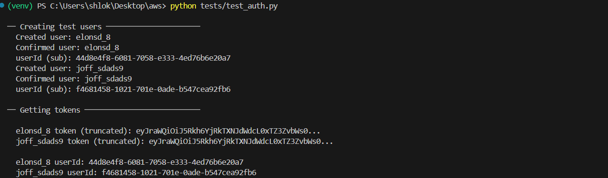
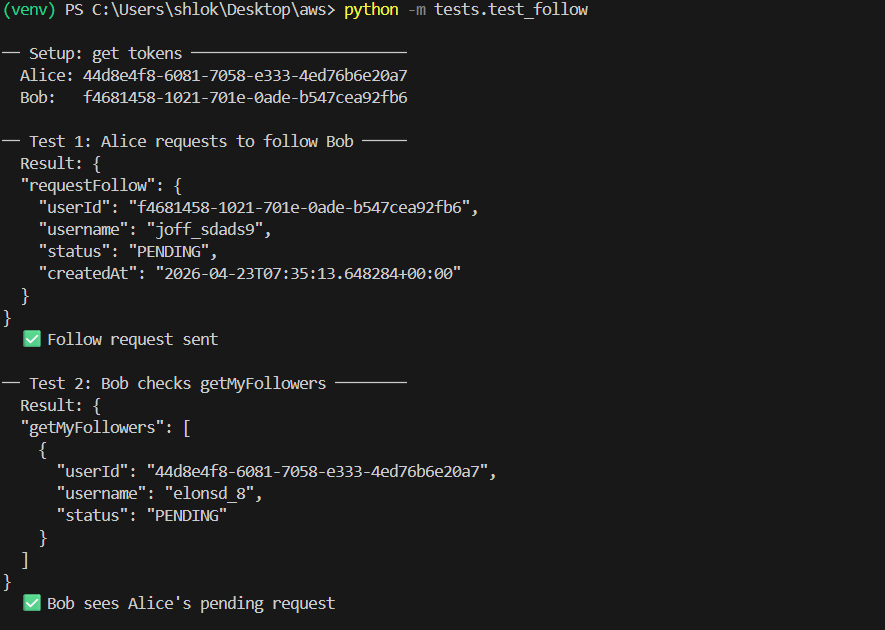
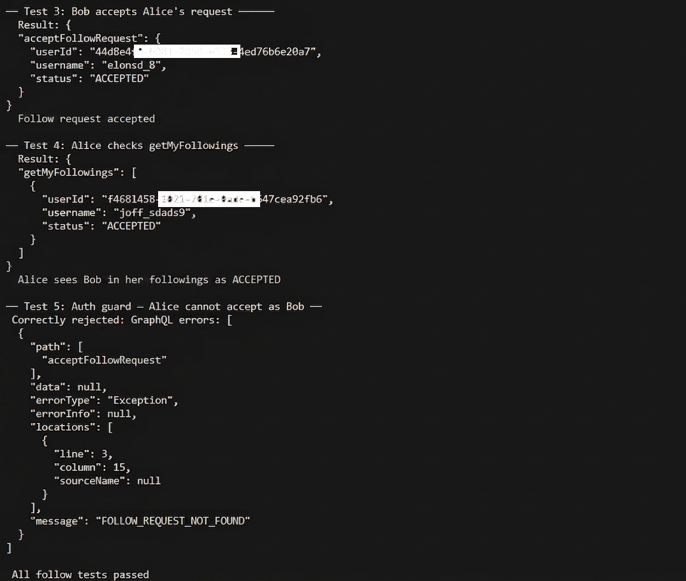
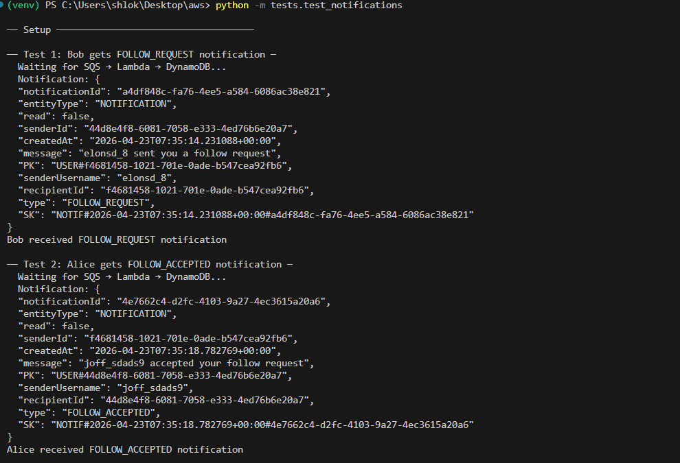
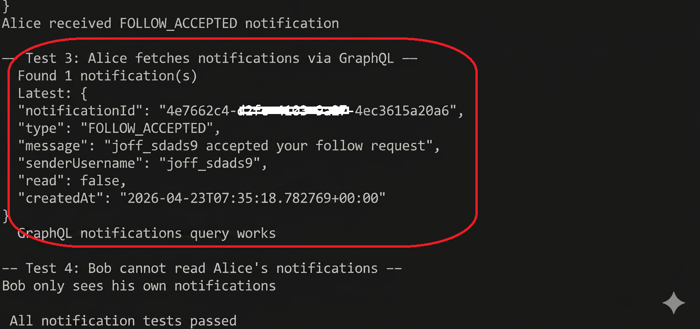
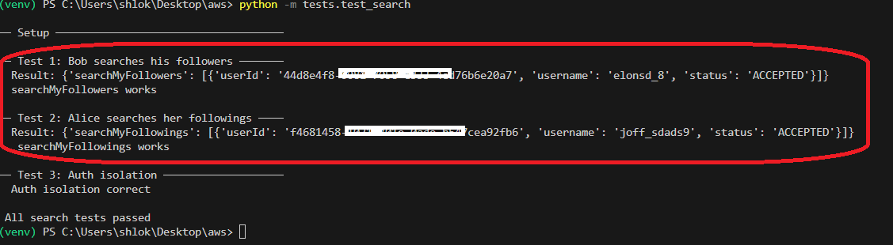

# Social Graph & Notifications API

A production-oriented GraphQL backend for a social application built on AWS. Supports user management, a bidirectional follow system with request/accept flow, asynchronous real-time notifications, and full-text search powered by Amazon OpenSearch Service.

---
# Request Flow: Follow System

1. Client sends `requestFollow` mutation via AppSync
2. Resolver validates caller identity from JWT
3. Follow record is written to DynamoDB (status = PENDING)
4. Message is pushed to SQS queue
5. Notification processor Lambda consumes message
6. Lambda triggers AppSync `createNotification` mutation (IAM-auth)
7. Notification stored in DynamoDB

---

# Request Flow: Accept Follow

1. Target user calls `acceptFollowRequest`
2. Resolver verifies requester identity
3. DynamoDB record updated (status = ACCEPTED)
4. DynamoDB Stream triggers OpenSearch sync Lambda
5. Lambda indexes updated relationship into OpenSearch

---

## Stack

| Layer | Service |
|---|---|
| API | AWS AppSync (GraphQL) |
| Auth | Amazon Cognito User Pools |
| Database | Amazon DynamoDB (single-table design per domain) |
| Search | Amazon OpenSearch Service |
| Async processing | Amazon SQS + AWS Lambda |
| Infrastructure | AWS CDK (Python) |
| Runtime | Python 3.10 |

---

## Project Structure

```
social-graph-api/
├── infrastructure/
│   ├── app.py
│   └── stacks/
│       ├── cognito_stack.py
│       ├── dynamodb_stack.py
│       ├── appsync_stack.py
│       ├── sqs_lambda_stack.py
│       ├── opensearch_stack.py
│       └── search_stack.py
├── functions/
│   ├── post_confirmation/
│   ├── resolvers/
│   │   ├── request_follow/
│   │   ├── accept_follow/
│   │   ├── get_followers/
│   │   ├── get_followings/
│   │   ├── get_notifications/
│   │   └── create_notification/
│   ├── notification_processor/
│   ├── opensearch_sync/
│   └── search_resolver/
├── tests/
│   ├── config.py
│   ├── test_auth.py
│   ├── test_follow.py
│   ├── test_notifications.py
│   └── test_search.py
├── schema.graphql
├── cdk.json
└── requirements.txt
```

---

## Proof of Working

The following screenshots demonstrate the successful deployment and execution of the test suite, covering authentication, follow relationships, asynchronous notifications, and OpenSearch-powered search.








---

## Prerequisites

- Python 3.10
- Node.js v18+ (for CDK CLI)
- AWS CLI v2 configured (`aws configure`)
- AWS CDK CLI (`npm install -g aws-cdk`)

---

## Deploy

```bash
# 1. Clone and enter the project
git clone <repo-url>
cd social-graph-api

# 2. Create and activate virtualenv
python3.10 -m venv .venv
source .venv/bin/activate        # Windows: .venv\Scripts\activate

# 3. Install dependencies
pip install -r requirements.txt

# 4. Bootstrap CDK (once per account/region)
cdk bootstrap aws://YOUR_ACCOUNT_ID/us-east-1

# 5. Deploy all stacks
cdk deploy --all --require-approval never
```

After deploy, note the printed outputs for `UserPoolId`, `UserPoolClientId`, and `GraphQLApiUrl`.

---

## Test

Paste the deploy output values into `tests/config.py`, then run in order:

```bash
# 1. Create and confirm Cognito test users
python tests/test_auth.py

# 2. Test the full follow flow + authorization guards
python -m tests.test_follow

# 3. Test async notification pipeline + GraphQL query
python -m tests.test_notifications

# 4. Test OpenSearch search + auth isolation
python -m tests.test_search
```

---

## Architectural Decisions

### 1. AWS CDK (Python) over Amplify CLI

Amplify Gen 2 requires TypeScript for infrastructure. Since the project is Python-first and needs full control over IAM policies, resolver wiring, and SQS/OpenSearch configuration, CDK was the appropriate choice.

### 2. DynamoDB Access Pattern Design

The follow relationship is indexed in both directions using a single item with dual key sets:
- **Base table**: `PK = USER#<requesterId>` / `SK = FOLLOWS#<targetId>`
- **GSI**: `GSI_PK = USER#<targetId>` / `GSI_SK = FOLLOWER#<requesterId>`

This allows O(n) lookups for both "Following" and "Followers" without scans.

### 3. Authorization Enforced in Resolvers

Beyond simple authentication, business-layer authorization is enforced in Lambda resolvers:
- `acceptFollowRequest` verifies the caller is the intended recipient of the request.
- `getMyFollowers/ings` injects the caller's `sub` as the partition key, preventing unauthorized data access.
- OpenSearch queries inject the caller's `sub` as a mandatory filter.

### 4. Asynchronous Notification Processing

Mutations publish events to SQS. A downstream Lambda consumes these and calls the AppSync `createNotification` mutation via IAM-signed HTTP. This ensures:
- Low mutation latency.
- Real-time delivery via AppSync Subscriptions.
- Built-in retries and DLQ support.

### 5. OpenSearch Sync via DynamoDB Streams

Follow records are synced to OpenSearch in real-time via DynamoDB Streams and a sync Lambda. This enables complex full-text search capabilities (like searching within my followers) that DynamoDB cannot handle natively, while keeping the database of record as the source of truth.

---

## Teardown

```bash
cdk destroy --all
```
